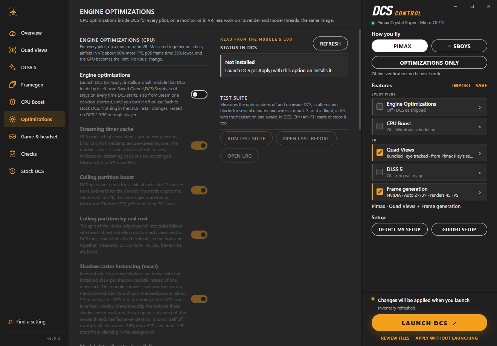

# DCS Control

A free Windows app that makes DCS World run faster, on a monitor or in VR, and sets up VR on Pimax headsets in one click.

- **Every pilot** (monitor, Quest, Varjo, Reverb, Pimax…): **Engine Optimizations** remove CPU work inside DCS without changing the image, about **+50-60 % FPS** at a busy airfield when DCS is CPU-bound. Once applied they stay on every time DCS starts, also from Steam or a desktop shortcut.
- **Pimax pilots** additionally get foveated rendering, DLSS 5 on the area you look at and frame generation, set up and launched with one button.

Everything the app changes is backed up and comes back with **Back to stock DCS**.

> **Early beta.** Flown mostly on one PC so far (Pimax Crystal Super, RTX 5090, Windows 11, DCS 2.9 Steam, single player), so expect rough edges. It was built with an AI coding assistant. Bug reports are very welcome: see [Reporting a problem](docs/USER_GUIDE.md#reporting-a-problem).

<p align="center">
  
</p>

| Engine Optimizations (every pilot) | Quad Views, read from Pimax Play | Back to stock DCS |
| --- | --- | --- |
|  |  |  |

## What it does

**For every pilot, on a monitor or with any headset**

- **Engine Optimizations:** a small module DCS loads by itself from Saved Games. It takes CPU work off DCS's render and model threads (multi-threaded G-buffer and shadows, faster culling, leaner memory and state handling) and leaves the image exactly the same. Measured at a busy airfield in VR: about **+50-60 % FPS** and **p95 frame time −34 %**; with everything on, the GPU becomes the limit. How much you gain depends on how CPU-bound you are.
- **CPU Boost:** gives DCS priority and its fastest cores while it runs, and fixes a DCS terrain loop that wastes CPU time (the fix also works when DCS starts from Steam).
- **Free VRAM:** closes memory-hungry apps before the flight and reopens them after.

Not on a Pimax? Choose **Optimizations only**: DCS runs exactly as you set it up (monitor, or your headset with its own software) and the app adds only these optimizations.

**For Pimax headsets (Pimax Play, or SteamVR with Sboys)**

- **Quad Views (foveated rendering):** sharp where you look, lighter in the periphery, eye-tracked. It uses the focus area you already set in Pimax Play. Keep Quad Views on in Pimax Play: the bundled Quad Views takes over from it for DCS.
- **DLSS 5 (DLSS-NR neural rendering)** on the focus area only, optionally just its central part to save GPU time, with an in-flight on/off key to compare.
- **Frame generation (OFXR):** Auto picks 2× when DCS can hold 45 FPS and 3× when it can't.
- **VR helpers:** a small DCS window on the monitor, a lower monitor mode while you fly, the in-headset panel (FPS, frame-generation mode, DLSS state, VRAM).

After each flight the Overview shows a **Last flight** summary.

## Quick start

1. **You need:** Windows 10 or 11 (64-bit; tested on 11) and DCS World 2.9. For the VR features: a Pimax headset with Pimax Play (or SteamVR with the Sboys driver) and an NVIDIA RTX GPU; for DLSS 5 your own `nvngx_dlssnr.dll` (tested with 310.8, not included).
2. **Download** `DcsControl-0.5.1-preview-win-x64.zip` from [Releases](https://github.com/NIGos/dcs-control/releases), unzip it anywhere and double-click `DcsControl.exe`. Inside you find only `DcsControl.exe`, `Install DCS Control.cmd` (adds it to the Start menu) and a `files` folder that must stay next to it.
3. **Choose how you fly** in the right panel: **Pimax**, **Sboys**, or **Optimizations only** (monitor or another headset). **Detect my setup** and **Guided setup** can do it for you.
4. **Tick the features** you want. Each one has its own page if you want to adjust it.
5. **Press Launch DCS.** Engine Optimizations then stay on whenever DCS starts. The VR features and CPU Boost need DCS to be started from the app.

The **[User Guide](docs/USER_GUIDE.md)** explains every feature, what it costs, the in-flight keys, and what to do when something goes wrong.

## Good to know

- **Single player only so far.** The app places a `dxgi.dll` loader (and, with the prefetch fix, `dxgi2.dll`) in DCS's `bin` folder and, with Engine Optimizations, a hook in `Saved Games\DCS\Scripts`. Multiplayer and server integrity checks haven't been tested.
- **Frame generation adds latency**, more in 3× than in 2×. Head movement stays smooth; the mouse cursor moves at DCS's own frame rate.
- **Start the app from the Start menu or Explorer**, not as administrator.
- **Formerly DCS VR Control.** The app was renamed in 0.5.0. Installing it replaces the old install; your backups and profiles are kept.
- **Before updating or repairing DCS**, close it and use **Back to stock DCS**.

## Credits and licences

DCS Control's own code is MIT-licensed ([LICENSE](LICENSE)). It builds on other people's work, each under its own licence:

- **Quad-Views-Foveated** by mbucchia (MIT)
- **CheekyFoveatedDLSS** (GPL-3.0), with local changes for the Quad Views focus views
- **OFXR Bridge** by tig3rmast3r and the **djules75 fork** (LGPL-3.0-or-later), with local patches
- **Sboys CustomHeadsetOpenVR** (GPL-2.0 source; downloaded from its official release, not bundled)
- **AMD FidelityFX SDK** (MIT), **Microsoft .NET** and the **WebView2 SDK**

The NVIDIA DLSS runtime is not included. Every release has a sources ZIP with the complete corresponding source. Details are in [docs/THIRD_PARTY.md](docs/THIRD_PARTY.md). DCS World is a trademark of Eagle Dynamics; Pimax, NVIDIA and DLSS are trademarks of their owners. This project isn't affiliated with any of them.

## Support

Feedback and bug reports go in [Issues](https://github.com/NIGos/dcs-control/issues). If the app saves you some frames and you'd like to buy me a coffee: [ko-fi.com/nigos](https://ko-fi.com/nigos). Thank you!

---

## For developers

### How it fits together

DCS (DX11) → Cheeky (DLSS 5 on the Quad Views focus views, D3D11↔D3D12 transport) → bundled Quad-Views-Foveated → OFXR frame generation → Pimax OpenXR runtime (or SteamVR with Sboys). The app gives the DCS process a private OpenXR runtime and layer environment, so nothing is registered globally. The design and the alternatives that were tried are in [docs/APPROACHES.md](docs/APPROACHES.md); performance measurements are in [docs/PERFORMANCE.md](docs/PERFORMANCE.md) and frame pacing in [docs/FRAME_PACING.md](docs/FRAME_PACING.md).

Third-party changes are kept as reproducible patches: `scripts/patch-cheeky.py` with `patches/cheeky`, `patches/ofxr-djules75/*.patch` applied by `scripts/build-ofxr-djules75.ps1`, and the Quad Views edits in `scripts/build-quadviews.ps1`. The prefetch fix is in `native/prefetch_fix`, the DCS engine optimizations (DcsQvCull) in `native/dcsqvcull`.

### Original files and recovery

The first time the app writes a path it backs up the original (or notes that there was none) under `%LOCALAPPDATA%\DcsControl\originals`. Later launches simply overwrite. **Back to stock DCS** puts every path back: backups are written back, new files are removed, and in `options.lua` only the settings the app changed are restored. Only a running DCS blocks it.

### Build and test

```powershell
./scripts/bootstrap-sdk.ps1
./scripts/fetch-integrations.ps1
./scripts/build-upstream.ps1 -Component cheeky
./scripts/build-ofxr-djules75.ps1
./scripts/build-quadviews.ps1
./scripts/build-prefetch-fix.ps1
./scripts/build-dcsqvcull.ps1
./.tools/dotnet/dotnet.exe run --project tests/DcsVr.Tests -c Release
./scripts/build-release.ps1
./scripts/test-release.ps1
```

Build scripts pin upstream revisions. Tests use isolated DCS fixtures and never start DCS. `scripts/package-sources.py` builds the corresponding-source ZIP. More: [validation](docs/VALIDATION.md), [adapter contracts](docs/QUAD_FOCUS_ADAPTER.md), [interface notes](docs/INTERFACE.md), [third-party components](docs/THIRD_PARTY.md).

### Command line

```powershell
./DcsVr.Cli.exe inventory
./DcsVr.Cli.exe validate --profile profile.json
./DcsVr.Cli.exe preview --profile profile.json
./DcsVr.Cli.exe status
./DcsVr.Cli.exe launch
./DcsVr.Cli.exe restore
```

`preview` only writes a private staging cache; `apply`, `launch` and `restore` change files. Commands that use the app's state refuse to run when Windows redirects `%LOCALAPPDATA%` into another app's package (pass `--state` to choose a folder).

### Documentation screenshots

The images in `docs/screenshots` are rendered by the app itself with a neutral demo layout, so no real user path appears:

```powershell
$env:WEBVIEW2_ADDITIONAL_BROWSER_ARGUMENTS = '--force-device-scale-factor=1'
$env:DCSVR_SMOKE_DEMO_ROOT = 'C:\DcsVrDemo'
$env:DCSVR_SMOKE_DOC_VIEWS = '1'
$env:DCSVR_TEST_NEURAL_PATH = 'C:\DcsVrDemo\Downloads\nvngx_dlssnr.dll'
./DcsControl.exe --web-smoke <output-folder>\interface
```
