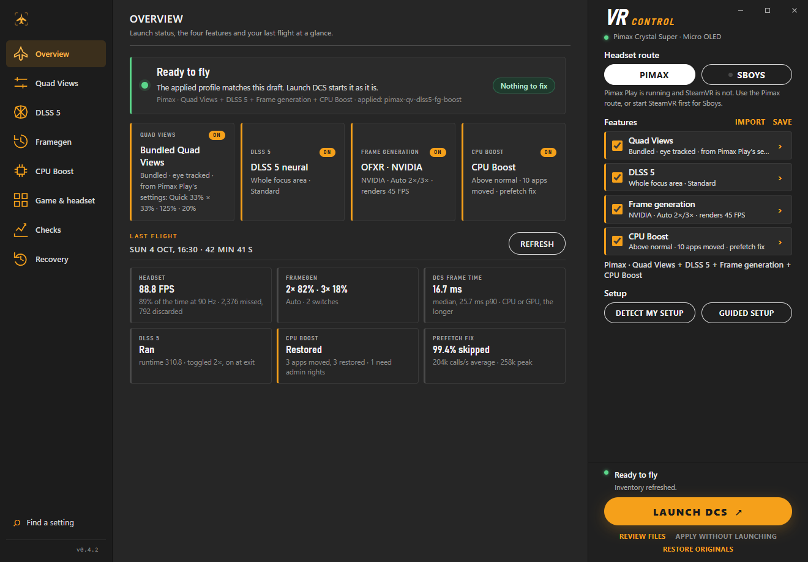
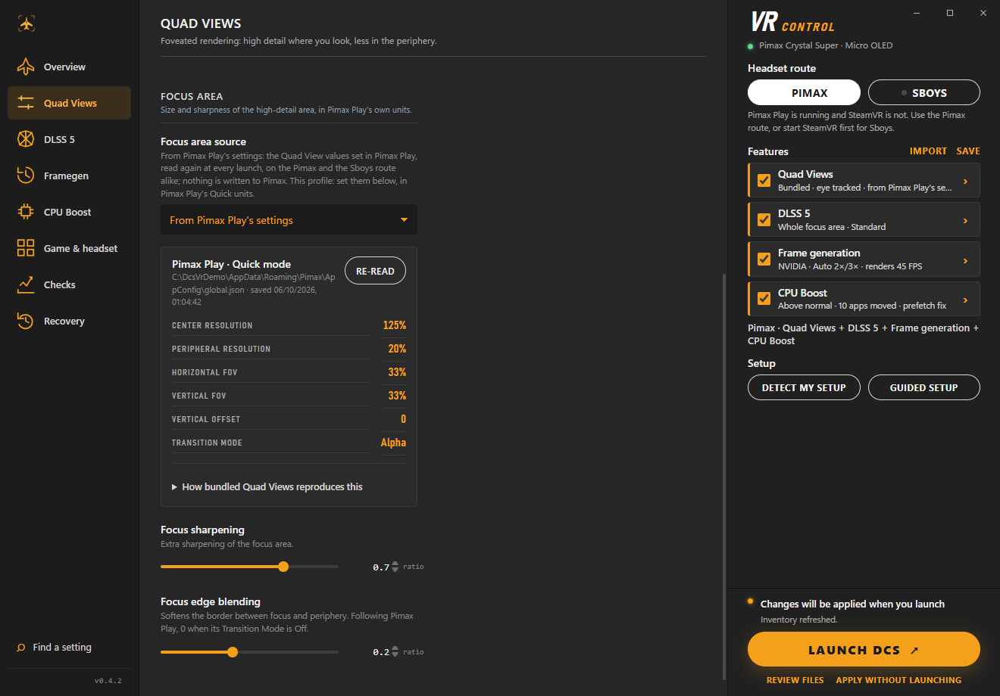
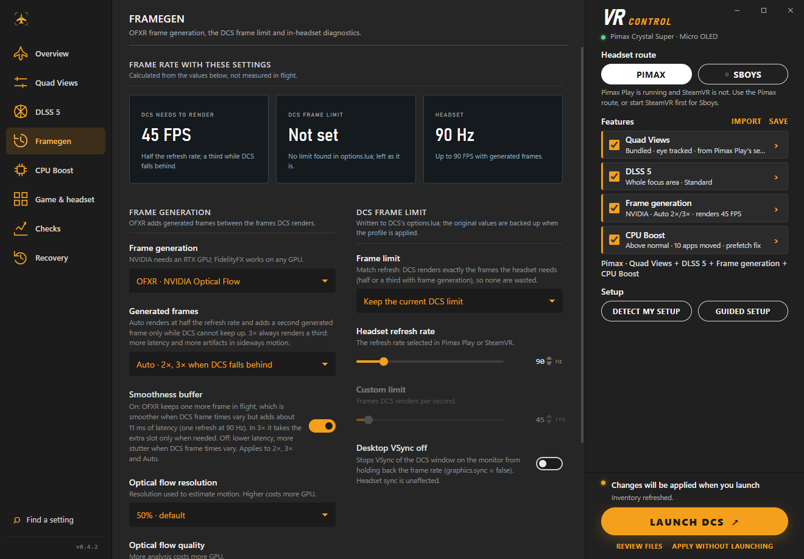
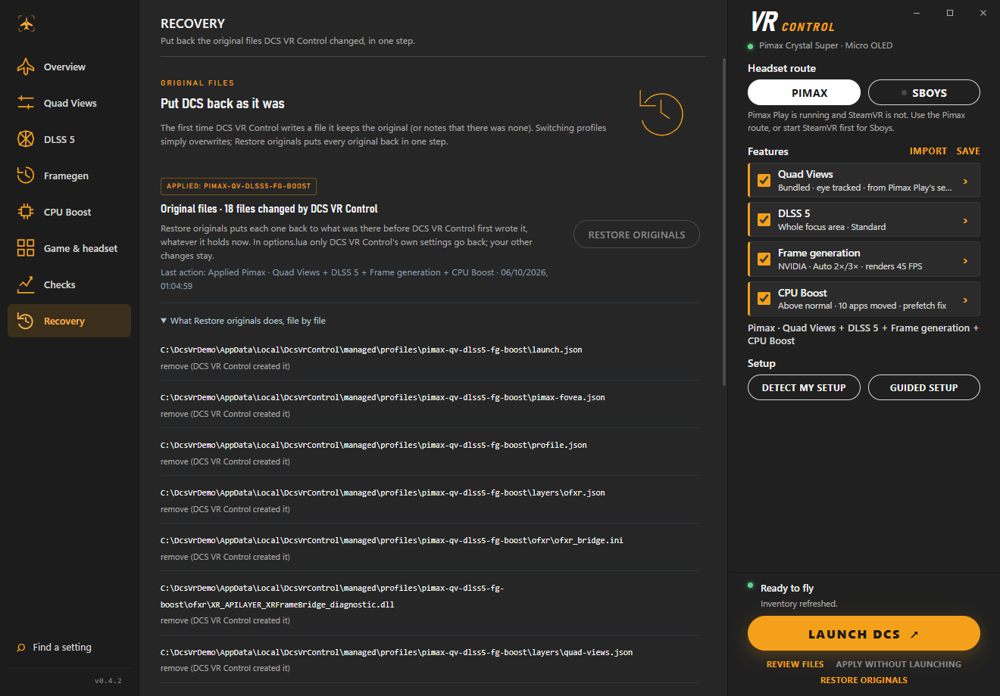

# DCS VR Control

**One-click VR performance mods for DCS World on Pimax headsets.** DCS VR Control is a free Windows app that sets up and launches DCS World in VR with foveated rendering (**Quad Views**, using your Pimax Play focus settings), NVIDIA **DLSS 5** neural rendering on the focus area, optical-flow **frame generation** (OFXR, Auto 2×/3×) and a **CPU Boost** for DCS, without copying files by hand. Tick the features you want and press **Launch DCS**: the app writes what is needed (backing up every original first), starts DCS with the right VR settings, shows a summary of your last flight, and puts everything back with one click when you want plain DCS again.

> **Early beta (0.4.2-preview).** Tested on one setup: Pimax Crystal Super, RTX 5090, Windows 11, DCS 2.9 (Steam edition), single-player. Expect rough edges and please [report problems](docs/USER_GUIDE.md#reporting-a-problem). Every file the app changes can be put back with **Restore originals**.

<p align="center">
  
</p>

| Quad Views with Pimax Play's values | Frame generation | Restore originals |
| --- | --- | --- |
|  |  |  |

## Quick start

1. **Check the requirements:** Windows 11 64-bit, an NVIDIA RTX GPU, a Pimax headset with Pimax Play (or SteamVR + Sboys), DCS World 2.9 (Steam or standalone). For DLSS 5, your own NVIDIA `nvngx_dlssnr.dll` 310.8.
2. **Download** `DcsVrControl-0.4.2-preview-win-x64.zip` from [Releases](https://github.com/NIGos/dcs-vr-control/releases), extract it and run **`Install.cmd`** (or just `DcsVrControl.exe`). Open the app from the Start menu, not as administrator.
3. **Click Detect my setup** (or **Guided setup**) in the right panel and accept what it found.
4. **Tick the features** you want (Quad Views, DLSS 5, Frame generation, CPU Boost) and adjust them on their pages if you like.
5. **Start your headset software and press Launch DCS.** Always start DCS from the app; use **Restore originals** before updating or repairing DCS.

**Read the [User Guide](docs/USER_GUIDE.md)** for every feature and what it costs, in-flight hotkeys, troubleshooting and the FAQ.

## Credits and licences

DCS VR Control's own code is MIT-licensed ([LICENSE](LICENSE)). It builds on the work of others, each under its own licence:

- **Quad-Views-Foveated** by mbucchia (MIT): foveated rendering
- **CheekyFoveatedDLSS** (GPL-3.0): DLSS integration, with local modifications for the Quad Views focus views
- **OFXR Bridge** by tig3rmast3r and its **djules75 fork** (LGPL-3.0-or-later): optical-flow frame generation, with local patches
- **Sboys CustomHeadsetOpenVR** (GPL-2.0 source; downloaded from its official release, not bundled)
- **AMD FidelityFX SDK** (MIT), **Microsoft .NET** and the **WebView2 SDK**

The NVIDIA DLSS runtime is not included; you supply it. Versions, revisions, modifications and redistribution notes are in [docs/THIRD_PARTY.md](docs/THIRD_PARTY.md); a corresponding-source archive accompanies each binary release. DCS World is a trademark of Eagle Dynamics; Pimax, NVIDIA and DLSS are trademarks of their respective owners. This project is not affiliated with any of them.

## Support

Support: [ko-fi.com/nigos](https://ko-fi.com/nigos). Thank you! Bug reports and feedback are welcome in [Issues](https://github.com/NIGos/dcs-vr-control/issues).

---

## For developers

Everything below is technical detail for contributors and testers: architecture, validation status, build and command-line use.

### Project status (technical)

A Windows application for preparing experimental DCS VR profiles on Pimax Super Micro OLED, with the original Pimax OpenXR runtime or the Sboys driver through SteamVR OpenXR.

The preview includes a local WebView2 interface with original aviation artwork, searchable settings, keyboard shortcuts, precise numeric inputs, reduced-motion support, a coverage illustration, rendering-pipeline cards, quality controls, diagnostics and recovery. Command-line tools, verified component packages, private OpenXR layer manifests, configuration previews, backups of the original files, and a per-user application installer accompany it. It has been built and tested without launching DCS or controlling the desktop.

**The combined pipeline is available as an experimental source adaptation.** A local Cheeky focus adapter preserves DCS's peripheral views, processes only proven focus outputs, and uses software Quad Views composition before OFXR stereo framegen. Both original Pimax and Sboys runtime routes are prepared. Real DLSS-NR 310.8, the Quad Views composition shaders and OFXR stereo optical flow now pass together on the RTX 5090 in an offscreen GPU test. Actual DCS mapping, DX11 transport, the complete OpenXR session, image quality and headset timing remain unverified.

**Tested in DCS without a headset (0.4.2).** DCS 2.9.30 (Steam) was started through the app with the SteamVR null HMD and the Pimax combined profile (fixed focus): all three layers load in the documented order, Quad Views composes four views, and the session ran about 26,800 frames without a frame error; apply, launch and restore completed through the product path. With software Quad Views, framegen uses a source-built OFXR layer (`components/ofxr`, `patches/ofxr/defer-until-submitted.patch`) that creates private swapchains only for swapchains submitted to the runtime; the official build exhausted SteamVR's swapchains (`XR_ERROR_LIMIT_REACHED`). Synthesized frames and DLSS-NR evaluation still need a 3D mission, and the Pimax runtime, eye tracking and image quality need the headset.

The chosen architecture and alternative approaches are documented in [APPROACHES.md](docs/APPROACHES.md). OFXR provides optical-flow frame generation; this package does not add native NVIDIA DLSS Frame Generation/Multi Frame Generation to DCS.

The release includes interface previews rendered from its actual executable without displaying a window (`docs/interface-*.png` in the ZIP). They illustrate a profile and do not contain live headset telemetry. The screenshots in [docs/screenshots](docs/screenshots) are rendered the same way (see [Documentation screenshots](#documentation-screenshots)).

### Run the application

Extract `DcsVrControl-0.4.2-preview-win-x64.zip` and run `DcsVrControl.exe`. The package includes .NET. Microsoft Edge WebView2 Evergreen Runtime is required; it is already present on the development PC. Install.cmd detects missing WebView2 / Microsoft C++ x64 prerequisites and obtains their official signed installers. [Microsoft runtime download](https://developer.microsoft.com/microsoft-edge/webview2/). `Install.cmd` optionally installs the application under `%LOCALAPPDATA%\Programs\DcsVrControl` and adds a Start menu shortcut. Application installation does not install game mods or activate VR drivers. Start with **Guided setup**; [SETUP.md](docs/SETUP.md) explains automatic checks, Pimax/Sboys installation, gaze requirements and recovery.

1. Confirm the DCS executable and Saved Games `Config\options.lua` paths.
2. Choose the headset route (Pimax or Sboys) and the features, then adjust their options.
3. Click **Launch DCS**. With DCS closed, it applies the profile shown (the first time it writes a file it backs up the original; afterwards it simply overwrites, also over a profile applied earlier), checks the launch contract and starts DCS. When nothing changed it just starts DCS; when only Pimax Play's Quad View values changed it updates the focus area first. **Review files** lists every file and DCS setting it will write, read-only; any error stops before DCS starts; the originals stay backed up.
4. Always start DCS with **Launch DCS** so the process receives its private OpenXR runtime and layer environment. A normal Steam shortcut does not receive that environment. For the Steam edition keep Steam running: the launch passes Steam's own launch identifiers so DCS does not restart itself through Steam (a restarted process loses the profile environment). Do not run DCS or this app as administrator; the OpenXR loader ignores the private runtime and layers in elevated processes, and the preflight blocks it.
5. Before repairing DCS or updating game files, close DCS and use **Restore originals** (Recovery). **Apply without launching** writes the profile without starting DCS.


### Available routes

| Route | Prepared integration | Remaining validation |
| --- | --- | --- |
| Pimax baseline | Original runtime, native Quad Views, native DLSS SR | Local headset baseline |
| Pimax framegen | Native Quad Views or stereo, OFXR NVIDIA/FidelityFX | DCS resource layout and synthetic presentation |
| Sboys framegen | SteamVR OpenXR, bundled software Quad Views, OFXR | Driver setup, gaze, composition, headset timing |
| Pimax or Sboys neural | Stereo, Cheeky foveated DLSS, optional DLSS 5 and OFXR | DX11/DX12 transport, stereo quality, latency |
| Pimax combined focus | Software Quad Views on Pimax OpenXR, adapted focus SR/NR, stereo OFXR | Actual DCS focus mapping, DX11 transport, seams and headset timing |
| Sboys combined focus | Same software composition on SteamVR OpenXR/Sboys | The above plus driver/gaze validation |
| Cheeky with native Pimax Quad Views | Rejected | Requires a different composition/presentation integration |

For a combined test, check **Quad Views**, **DLSS 5** and **Frame generation** in the right panel (Pimax or Sboys route). Keep the alternative Quad Views provider path empty. With Quad Views and DLSS 5 together the bundled Quad Views and the focus adapter are selected automatically; supply the NVIDIA runtime before previewing. For an initial mapping/composition test without neural processing, turn DLSS 5 off and Foveated DLSS on. The adapter then runs the full focus SR region; Quad Views controls spatial foveation.

Sboys 1.3.0 is obtained directly from its official release or imported from its original ZIP. **Download / verify** checks its pinned hash and extracts it without activation. Its binary release contains private functionality and is not bundled here. Its official GUI handles installation, tracking selection, calibration, and distortion. That configuration is outside the original files the app backs up. The runtime selector alone does not activate Sboys or prove its gaze output works.

For DLSS 5, supply a compatible NVIDIA `nvngx_dlssnr.dll` 310.8. The importer checks x64 architecture, an NVIDIA Authenticode signature using cached trust information, and the supported runtime version. A valid signature/version does not prove a functioning DCS session. The proprietary NVIDIA runtime is not included.

The fovea controls configure Cheeky or the bundled software Quad Views provider. Native Pimax and alternative providers retain their own coverage controls, and the app disables its inactive coverage sliders. The bundled provider caps fovea sections at 90%, as required by its upstream implementation. Neural intensity, working scale, before/after SR placement, and NVIDIA optical-flow resolution are configurable in the interface.

The **DLSS 5** page has the DLSS 5 switch and its runtime file, Foveated DLSS on its own, the DLSS 5 image controls (working scale, area, intensity, style, processing order, and the in-flight toggle key, recorded by pressing it) and, folded under **Advanced image controls**, the RenoDX-style tone, structure, skin, mask, UI, colour, transfer, depth and motion corrections with **Reset to defaults**. See [NEURAL_TUNING.md](docs/NEURAL_TUNING.md) for mappings, defaults and hardware-test scope. Its actual interface is shown in [the DLSS 5 screenshot](docs/screenshots/dlss5-runtime-file.png).

There are no quality presets: every quality value (focus resolution, sharpening, edge blending, optical-flow resolution, quality and direction, neural working scale) is set directly on its feature's page and nothing changes it for you. See [PERFORMANCE.md](docs/PERFORMANCE.md) for the RTX 5090 hardware timings, tradeoffs and test limits.

The **Framegen** page configures frame generation and the DCS frame limit (keep, match refresh, 300 FPS or custom) and desktop VSync, shows what DCS must render for the selected refresh rate, and holds the in-headset diagnostics (panel key, VRAM counter, OFXR counter and log). Other limiters (NVIDIA, RTSS) and runtime motion smoothing are listed by preflight as checks you do yourself; the app neither reads nor changes them. See [FRAME_PACING.md](docs/FRAME_PACING.md).

The **Overview** shows what Launch DCS will do now (Ready to fly, or the changes it applies), how many things to fix or check (in **Checks**, grouped Must fix / Check yourself / OK) and the **last flight**, read from the logs after DCS exits: headset FPS and missed frames (Pimax runtime log), time at 2× and 3× and DCS frame time (OFXR log), DLSS 5, CPU Boost and the prefetch fix. The draft on screen is kept across app restarts; **Reset to applied** goes back to the applied profile. See [INTERFACE.md](docs/INTERFACE.md).

### Recovery and diagnostics

Profiles, extracted packages, and the original files are stored under `%LOCALAPPDATA%\DcsVrControl` (`originals`: `baseline.json`, the backups and `originals.log`). There is one model: the first time DCS VR Control writes a path it backs up the original (or notes that there was none); every later apply simply overwrites, whatever is there (files of an earlier profile, leftovers, files you edited). Another program's file (another mod's `dxgi.dll` or `dxgi2.dll`, ReShade) is backed up the first time and replaced, and Launch says so ("Replaced another dxgi.dll … Restore originals brings it back"). **Restore originals** (Recovery) puts every path back to its original whatever it holds now: backups are written back, files that did not exist are removed, and in `options.lua` only the settings DCS VR Control changed go back (your other edits stay; a file that can no longer be read gets the whole original back). Only a running DCS stops it. Keep that state directory until you have restored the originals. Journals of earlier versions (`transactions`) are converted on first start: for each path the original is the one recorded by the oldest journal that was not restored; the old folder is kept as `transactions.converted` and the conversion is written to `originals.log`.

The diagnostic export records detected files and versions, runtime manifests, implicit layers, saved DCS settings, compatibility issues, package versions, and the original files DCS VR Control changed. It contains local paths. OFXR's log and its always-on FPS counter can be enabled per profile under **In-headset diagnostics**; the counter counts accepted submissions, not physical panel refreshes.

The GUI presents checks from the last inventory separately from the editable profile. **Launch DCS** builds and checks the deployment plan itself at the moment of the click (with Pimax Play's values read then), so there is no separate preview to approve; **Review files** shows the same plan read-only. Imported profiles retain their identity and numeric precision until a feature is changed; the profile name then follows the route and the checked features. Turning features on or off keeps your selected neural runtime.

Before launch, the manager verifies installed files, owned DCS settings, and runtime/provider dependency hashes saved by 0.2.1 and newer profiles. The `launch-check --state folder` CLI command performs those checks without executing DCS. When an installed file or dependency changed since Apply, **Launch DCS** (and `DcsVr.Cli launch`) writes the profile again over it. For native Pimax coverage, use the Pimax controls; the illustrated sizes are not measured headset values.

`Uninstall.cmd` from the extracted release removes owned application files after verifying their hashes. It retains game-mod backups and profiles. Restore game mods in the app before uninstalling it. The preview is locally built and unsigned.

### Build and offline verification

```powershell
./scripts/bootstrap-sdk.ps1
./scripts/fetch-integrations.ps1
./scripts/build-upstream.ps1 -Component cheeky
./scripts/build-ofxr-full.ps1
./scripts/build-quadviews.ps1
./scripts/test-loader.ps1
./.tools/dotnet/dotnet.exe run --project tests/DcsVr.Tests -c Release -- .
./scripts/build-release.ps1
```

Build scripts pin upstream revisions and reproducibly apply the opt-in focus adaptation. The MSVC helper currently uses the local Visual Studio 18 Build Tools location. See [validation evidence](docs/VALIDATION.md), [first headset test](docs/FIRST_FLIGHT.md), [adapter contracts](docs/QUAD_FOCUS_ADAPTER.md), [research and architecture](PLAN_DCS_VR.md), and [third-party components](docs/THIRD_PARTY.md). A separate corresponding-source archive contains the manager, modified upstream snapshots and dependencies. Its `UPSTREAM_REVISIONS.json` identifies base commits; snapshots include local modifications.

### Command-line examples

```powershell
./DcsVr.Cli.exe inventory
./DcsVr.Cli.exe readiness --profile profile.json --out readiness.json
./DcsVr.Cli.exe diagnostic --out diagnostic.json
./DcsVr.Cli.exe validate --profile profile.json
./DcsVr.Cli.exe preview --profile profile.json
./DcsVr.Cli.exe status
./DcsVr.Cli.exe restore
```

`preview` writes only its private staging cache. `status` lists the original files and the applied profile. `apply`, `restore` (Restore originals), and `launch` are explicit actions. Commands that use the app's state refuse to run from a shell whose `%LOCALAPPDATA%` Windows redirects into another app's package (pass `--state` to choose a folder explicitly). The development verification uses isolated DCS fixtures and never invokes `launch` against DCS.

### Documentation screenshots

The PNGs in `docs/screenshots` come from the app's own WebView2 renderer with a neutral fixture, so no path shows a real user or machine. Build the app, then run it with `DCSVR_SMOKE_DEMO_ROOT` set to an empty neutral folder (the fixture is laid out there like a real PC: Steam library, Saved Games, AppData) and, for the DLSS 5 page, `DCSVR_TEST_NEURAL_PATH` pointing to a copy of `nvngx_dlssnr.dll` inside that folder:

```powershell
$env:WEBVIEW2_ADDITIONAL_BROWSER_ARGUMENTS = '--force-device-scale-factor=1'
$env:DCSVR_SMOKE_DEMO_ROOT = 'C:\DcsVrDemo'
$env:DCSVR_SMOKE_DOC_VIEWS = '1'
$env:DCSVR_TEST_NEURAL_PATH = 'C:\DcsVrDemo\Downloads\nvngx_dlssnr.dll'
./DcsVrControl.exe --web-smoke <output-folder>\interface
```

The full web smoke runs first; the documentation views are then written to the output folder at 1320 × 920 under the names used in `docs/screenshots` (`right-panel-features.png` is a crop of the Overview's right panel, x 960–1320). Check every image for personal paths before committing it.
