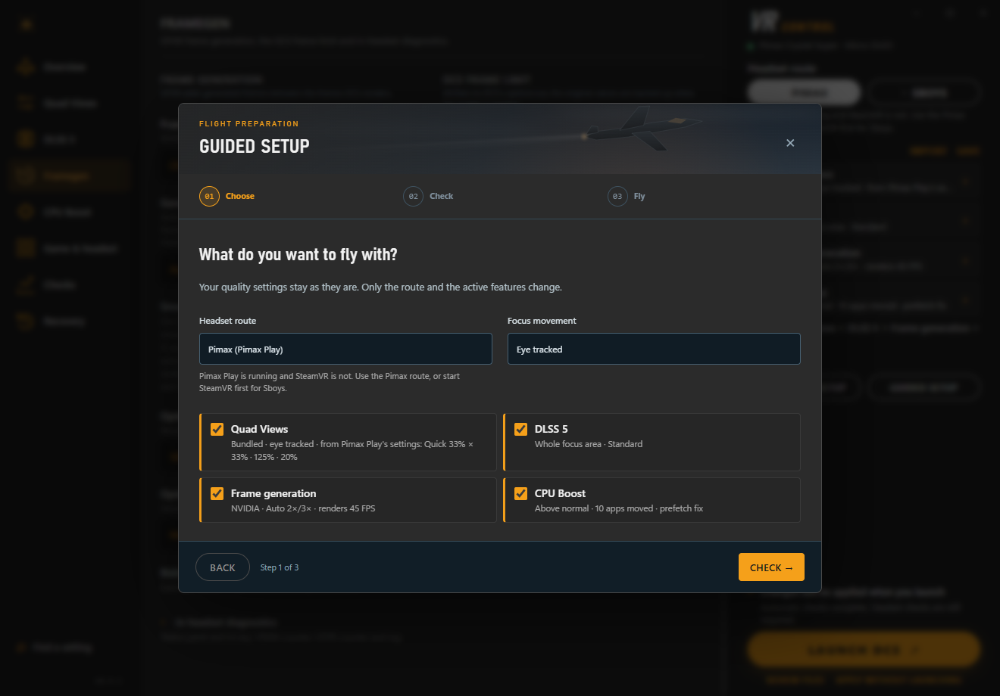
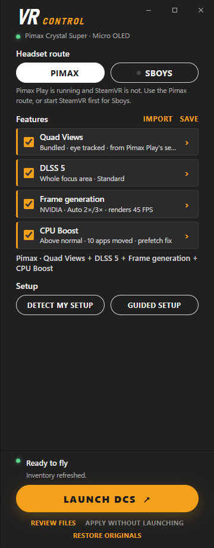
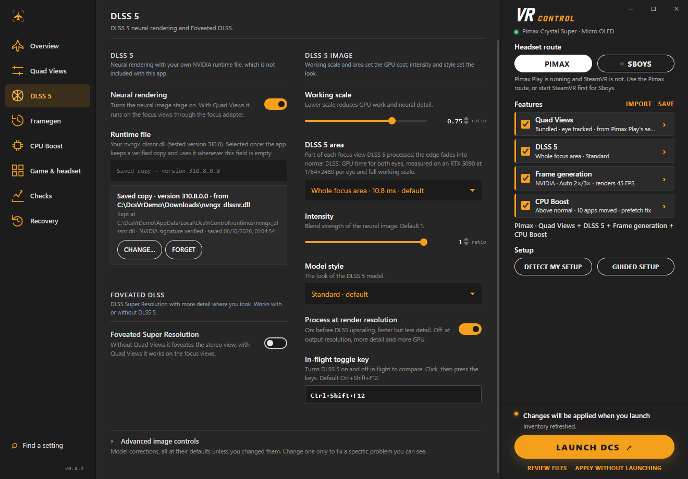
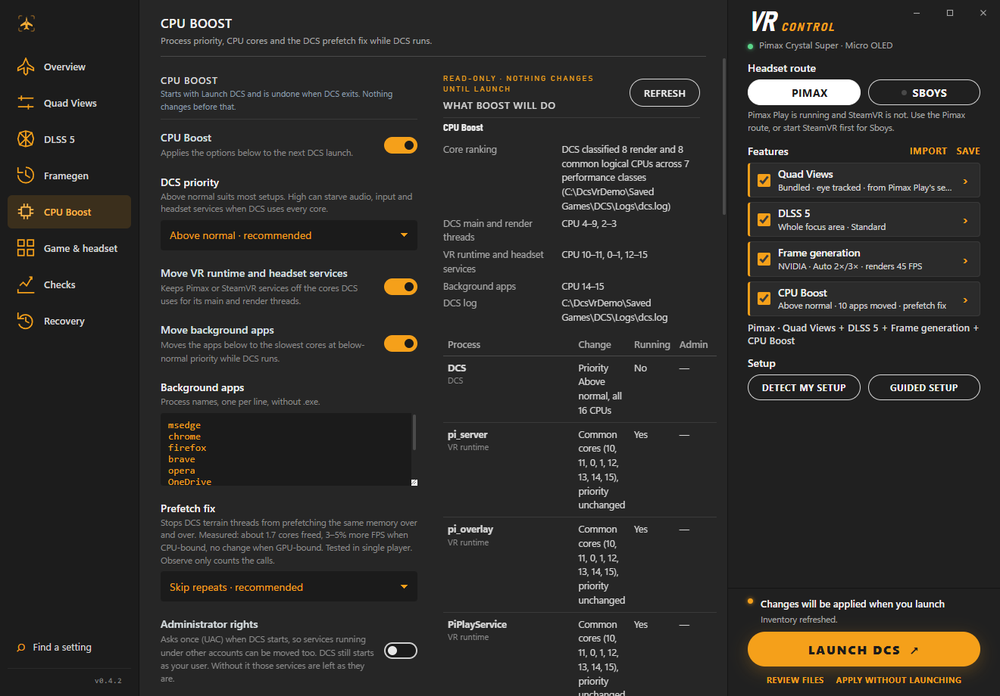
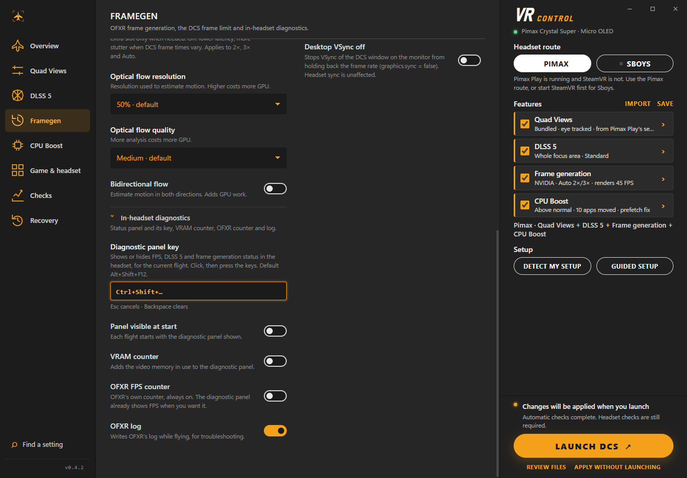
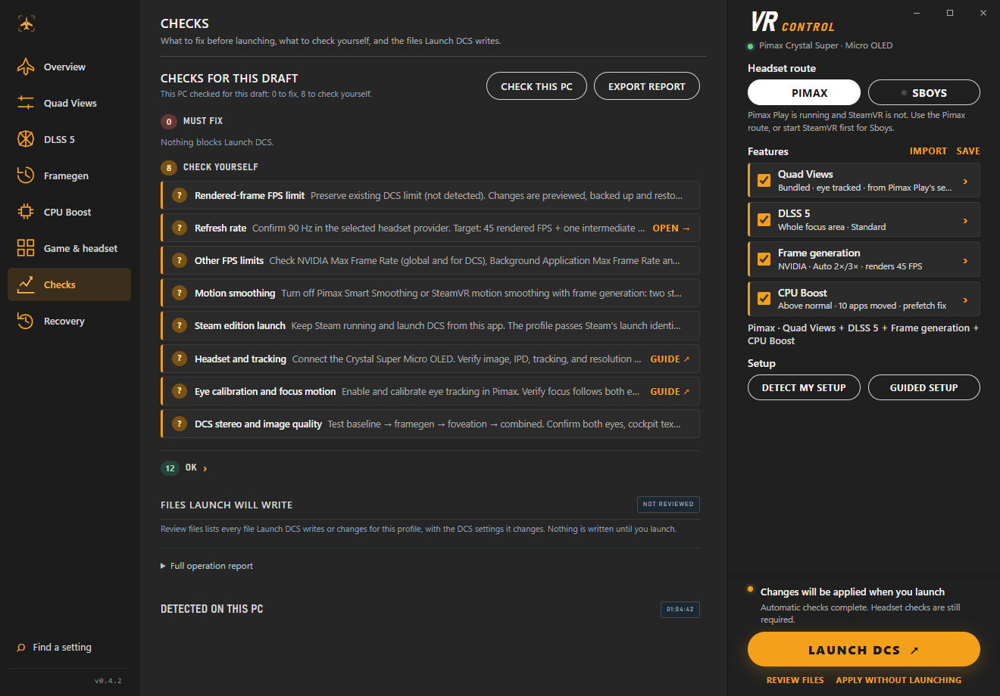

# DCS VR Control — User Guide

**Version 0.4.2-preview (early beta).** This guide is for pilots. It explains what the app does, how to set it up and how to get help. Developer documentation lives in the [README](../README.md#for-developers) and the other files in `docs/`.

> **Early beta.** DCS VR Control has been flown on one PC (Pimax Crystal Super, RTX 5090, DCS 2.9 Steam edition). Expect rough edges. Every file it changes is backed up and can be put back with one click (**Restore originals**), so trying it is safe — but please read [Requirements](#requirements) and [Launch DCS](#launch-dcs) before your first flight.

## Contents

- [What the app does](#what-the-app-does)
- [Requirements](#requirements)
- [Install](#install)
- [First run](#first-run)
- [The four features](#the-four-features)
- [Launch DCS](#launch-dcs)
- [In flight: hotkeys and the diagnostic panel](#in-flight-hotkeys-and-the-diagnostic-panel)
- [After the flight: the Last flight card](#after-the-flight-the-last-flight-card)
- [Checks](#checks)
- [Restore originals (Recovery)](#restore-originals-recovery)
- [Troubleshooting and FAQ](#troubleshooting-and-faq)
- [Reporting a problem](#reporting-a-problem)
- [Support](#support)

## What the app does

DCS VR Control prepares and starts DCS World in VR with a set of performance and image mods, without you copying files by hand:

| Feature | What you get |
| --- | --- |
| **Quad Views** | Foveated rendering: DCS draws a sharp *focus* area where you look (eye tracked or fixed in the centre) and a lower-resolution periphery. Uses the focus values you already set in Pimax Play. |
| **DLSS 5** | NVIDIA's DLSS-NR neural rendering, applied to the Quad Views focus area (you bring the NVIDIA runtime file). Optional Foveated DLSS (Cheeky) on top. |
| **Frame generation** | OFXR optical-flow frame generation: DCS renders half (or a third) of the headset refresh rate and generated frames fill the rest. |
| **CPU Boost** | Gives DCS priority and its best CPU cores while it runs, keeps VR services and background apps off those cores, and an optional fix for a DCS terrain loop that wastes CPU. Plus three VRAM helpers. |

You tick the features you want in the right panel, adjust them on their pages if you like, and press **Launch DCS**. The app writes the needed files into DCS (backing up the originals the first time), starts DCS with the right VR settings, and puts everything back when you press **Restore originals**.

What it does **not** do: it does not change Windows settings, your GPU driver settings, your global OpenXR runtime or your DCS graphics settings (apart from a few listed `options.lua` values such as the frame limit, which it restores). It does not add NVIDIA DLSS Frame Generation to DCS; frame generation here is OFXR's optical flow.

## Requirements

- **Windows 11, 64-bit.** Run as a normal user — not as administrator.
- **NVIDIA RTX graphics card** for DLSS 5 and for NVIDIA optical-flow frame generation. (The Framegen page also offers FidelityFX, which works on any GPU, but the tested setup is NVIDIA.) Development and testing: RTX 5090.
- **Pimax headset** (tested: Crystal Super Micro OLED) with either
  - **Pimax Play** (the original Pimax OpenXR runtime), or
  - **SteamVR with the Sboys driver** (CustomHeadsetOpenVR 1.3.0; for SLAM tracking it needs Pimax EVO).
- **DCS World 2.9**, Steam edition or standalone.
- **Microsoft Edge WebView2 Runtime** (already on most Windows 11 PCs) and the **Microsoft Visual C++ x64 runtime 14.50 or newer**. `Install.cmd` checks both and installs them from Microsoft if they are missing.
- For DLSS 5: your own signed NVIDIA **`nvngx_dlssnr.dll`, version 310.8** (see [DLSS 5](#dlss-5)). It is not included and the app does not download it.

## Install

Download `DcsVrControl-0.4.2-preview-win-x64.zip` from the [Releases page](https://github.com/NIGos/dcs-vr-control/releases) and extract it to a folder of your choice. Then either:

- **Run it directly:** double-click `DcsVrControl.exe` in the extracted folder (.NET is included), or
- **Install it:** double-click `Install.cmd`. It verifies the files, installs the app for your Windows user under `%LOCALAPPDATA%\Programs\DcsVrControl`, adds **DCS VR Control** to the Start menu, and installs WebView2 / the C++ runtime from Microsoft if they are missing (this step may need internet access and an administrator prompt for the C++ runtime).

Installing the app does not touch DCS or your VR software. Nothing is written into DCS until you press **Launch DCS** (or **Apply without launching**).

The preview is not code-signed, so Windows SmartScreen may warn you the first time you open it.

> **Always open the app from the Start menu or from Explorer**, not from a script runner or another program's terminal. See [the DCS launcher option](#the-dcs-launcher-option) for why.

## First run

### Detect my setup

Click **Detect my setup** in the right panel. The app looks at what runs on your PC and proposes a profile: the headset route (Pimax Play, or SteamVR with Sboys), eye tracking, the refresh rate SteamVR uses, your Pimax Play Quad View values and a valid DLSS 5 runtime file (it looks in Downloads, Documents and Desktop). Each value shows where it came from; nothing changes until you accept.

### Guided setup

Or click **Guided setup** for three short steps:

1. **Choose** — headset route, the features you want and, with Quad Views, whether the focus follows your eyes or stays centred. Your quality settings are kept.
2. **Check** — the app checks files, the VR runtime, package hashes, the DLSS runtime file and (on Sboys) the driver and gaze bridge. Problems are listed first; nothing is written in this step.
3. **Fly** — start your headset software, then press **Launch DCS**.

Closing the wizard before **Launch DCS** writes nothing.

### The right panel

- **Headset route** — **Pimax** (Pimax Play) or **Sboys** (SteamVR). The line below shows which one is running; the app warns you if your profile uses the other one.
- **Features** — one row per feature: tick it on or off, read its current settings at a glance, click the row to open its page.
- **Import / Save** — load or save a profile file.
- **Launch DCS** — the one button you need. Under it: **Review files** (what Launch will write, read-only), **Apply without launching** and **Restore originals**.

Everything you change is kept as a draft across app restarts. **Reset to applied** (shown when the draft differs) brings back what is currently installed.

## The four features

### Quad Views

The app uses its **bundled Quad Views** (Quad-Views-Foveated). This is the one that works with DLSS 5 and frame generation. **Pimax native** Quad Views (Pimax route only) is also offered, but it cannot be combined with DLSS 5 or Foveated DLSS.

- **Focus movement** — *Eye tracked* (needs working eye tracking in Pimax Play, or a gaze bridge on Sboys) or *Fixed (centred)*.
- **Focus area source** — *From Pimax Play's settings* (default) or *This profile*.
  - With **Pimax Play's settings**, the app reads your Quad View values from Pimax Play every time you launch (on both routes; it never writes to Pimax). The page shows them **exactly as Pimax Play shows them**: same labels, same order, same rounding — for **Quick** mode: Center Resolution, Peripheral Resolution, Horizontal FOV, Vertical FOV, Vertical Offset, Transition Mode; for **Fine** mode: the "→ Center" sliders, Transition Range and Alpha.
  - The app follows whichever tab is active in Pimax Play. **Note:** in Pimax Play, simply clicking the *Fine* tab switches Pimax to Fine mode, so the app will read the Fine values from then on. Go back to *Quick* in Pimax Play if that is the one you want.
  - If you change the values in Pimax Play, you don't need to do anything else: the next **Launch DCS** updates the focus area ("Pimax Play changed: focus updated to …").
  - With **This profile**, you set the values in the app, in the same Quick units as Pimax Play.
- **Focus sharpening**, **edge blending**, **turbo mode** — fine-tuning. Turbo is off by default: in flight it caused a visible "old frames" effect when turning the head.
- **How bundled Quad Views reproduces this** (folded) shows the conversion and, once DCS has run, the focus size in pixels per eye.

**Cost/benefit, measured on the test PC (Crystal Super, RTX 5090):** with Pimax Play's own Quad View values, bundled Quad Views ran at about **78 FPS** with working eye tracking, against about 37 FPS with the much larger old defaults. At the same Pimax percentages, bundled Quad Views draws a smaller focus than Pimax's own runtime does, so it is roughly three times cheaper. The bundled provider is limited to 90% of the view per axis.

### DLSS 5

DLSS 5 runs NVIDIA's DLSS-NR neural model on the two Quad Views focus views. DCS's own DLSS keeps running as usual.

**The runtime file — bring your own.** DLSS 5 needs NVIDIA's `nvngx_dlssnr.dll`, **version 310.8**, x64, signed by NVIDIA Corporation. It is not included in this app. Select it once with **Browse** (or let **Detect my setup** find it): the app checks it and keeps a **verified copy** in `%LOCALAPPDATA%\DcsVrControl\runtimes`, which every profile then uses. The page shows "Saved copy · version 310.8.0.0 · from …" with **Change…** and **Forget**. A file that fails the checks is refused and nothing is saved.

Settings:

- **Working scale** — lower = less GPU work and less neural detail.
- **DLSS 5 area** — the whole focus area (default) or its central 80%, 70% or 50%, faded into the normal image at the edge. Measured GPU time for both eyes on an RTX 5090 at 1764×2480 per eye: **10.75 ms** whole area, **7.9 ms** at 80%, **6.35 ms** at 70%, **4.8 ms** at 50%.
- **Intensity** (default 1 = full model output) and **Model style** (Standard, Natural, Cinematic) change the look, not the cost.
- **Process at render resolution** — on: before DLSS upscaling (faster, subtler); off: at output resolution (more detail, more GPU).
- **In-flight toggle key** — turn DLSS 5 on/off in flight to compare (default **Ctrl+Shift+F12**).
- **Advanced image controls** (folded) — model corrections, all at their defaults; change one only to fix something specific you can see. **Reset to defaults** puts them back.
- **Foveated Super Resolution** (Cheeky) is a separate switch on the same page.

### Frame generation

OFXR generates frames between the frames DCS renders. The top of the page shows what DCS needs to render for your headset refresh rate (for example 45 FPS for 90 Hz).

- **Frame generation** — *OFXR · NVIDIA Optical Flow* (needs an RTX GPU) or *FidelityFX*.
- **Generated frames**
  - **2×** — DCS renders half the refresh rate (45 FPS at 90 Hz).
  - **3×** — DCS renders a third (30 FPS at 90 Hz): more headroom, but **more latency and more artifacts in sideways motion**.
  - **Auto 2×/3×** (default) — runs 2× while DCS can hold half the refresh rate with margin, drops to 3× when DCS falls behind, and tries 2× again later. The diagnostic panel shows "2x auto" / "3x auto".
- **Smoothness buffer** (on by default) — keeps one more frame in flight: smoother when DCS frame times vary, but adds about one refresh of latency (about 11 ms at 90 Hz). Off = lower latency, more stutter when frame times jump.
- **Latency trade-off, measured on an earlier build:** about 55 ms in 2× and about 88 ms in 3× from the start of a DCS frame to its display. If 3× feels laggy, see the [FAQ](#framegen-3-feels-laggy).
- **Optical flow resolution / quality** and **bidirectional flow** — higher costs more GPU.
- **DCS frame limit** — keep your current DCS limit (default), match the refresh rate, 300 FPS, or a custom value. Written to `options.lua` and restored with the originals.
- **Desktop VSync off** — stops VSync of the desktop DCS window from holding the frame rate back. Headset sync is unaffected.
- **Before you fly:** turn off other limiters and smoothing that fight frame generation — NVIDIA *Max Frame Rate* / *Background Application Max Frame Rate*, RTSS, Pimax Smart Smoothing, SteamVR motion smoothing. The app does not change these; Checks reminds you.

### CPU Boost

CPU Boost is off by default. When on, a small helper starts with DCS and **undoes everything when DCS exits**:

- **DCS priority** — Above normal (default), Normal or High (High can starve audio, input and headset services).
- **Move VR runtime and headset services** off the cores DCS uses for its main and render threads (Pimax route; on SteamVR the compositor is left alone).
- **Move background apps** (your list, e.g. browsers, OneDrive) to the slowest cores at below-normal priority.
- The core ranking comes from DCS's own CPU classification in `dcs.log`, so **DCS needs to have run once** on this PC. Without a ranking, only DCS's priority changes, and the page says so.
- **What Boost will do** shows the exact plan for your PC before you launch: which processes, which cores, what is running now, and what needs administrator rights. **Administrator rights** (optional) lets it move services that run under other accounts; DCS still starts as your user.

**Prefetch fix** (Off / Observe / Skip repeats; Skip by default with Boost): DCS's terrain threads ask Windows to prefetch the same memory over and over (hundreds of thousands of calls per second). Skipping the repeats freed about **1.7 CPU cores** and gave about **3–5% more FPS when CPU-bound** (no change when GPU-bound) in the prototype. **Only single-player has been tested.** It works as a DLL that DCS loads itself: the app places `dxgi.dll` (the Cheeky loader) and `dxgi2.dll` (the fix) in the DCS `bin` folder. Nothing is injected from outside. Statistics go to `bin\DcsVrPrefetchFix.log`.

#### Flight helpers (VRAM)

Three more options on the CPU Boost page, all off by default and usable without CPU Boost:

- **Free VRAM before flight** — closes the listed programs when DCS starts so their video memory goes to DCS (default list: NVIDIA Overlay, Edge, ChatGPT, Hue Sync, Razer Cortex/Synapse, Wallpaper Engine; Discord and OBS are deliberately not listed). Programs get a normal close request; they are ended after 5 s only if you allow it. **Reopen after the flight** starts them again when DCS exits. What Boost will do shows each program's VRAM now (approximate). Measured on the test PC: NVIDIA Overlay held about 1.4 GB.
- **Small DCS window in VR** — sets the DCS desktop window to 1280×720 windowed (restored with the originals). The headset image is unchanged; the smaller desktop buffers save some VRAM and GPU time.
- **Lower the monitor while flying** — switches your main monitor to a smaller mode (1920×1080 at 60 Hz suggested) for the flight only; the previous mode comes back when DCS exits, even after a crash (at the next start). Windows never saves the flight mode. HDR is left alone.

## Launch DCS

Press **Launch DCS** (right panel, Overview or the last step of Guided setup). With DCS closed, it:

1. **Checks** the profile (validation, file hashes, your Pimax Play values) — any error stops here, before anything is written.
2. **Applies what changed**: if your draft differs from what is installed, it writes the profile. The first time a file is written, the original is **backed up** (or noted as absent). If nothing changed, nothing is written. If only Pimax Play's values changed, only the focus area is updated.
3. **Starts DCS** directly (skipping the DCS launcher window) with its private VR settings, so only this DCS session uses the profile's layers. The CPU Boost helper starts with it if enabled.

The status line says **Ready to fly** (installed files match the draft), **Changes will be applied when you launch**, or **DCS is running**.

Good to know:

- **Always start DCS with Launch DCS.** A Steam or desktop shortcut does not pass the profile's VR settings to DCS.
- **Steam edition: keep Steam running.** The app passes Steam's launch identifiers so DCS does not restart itself through Steam (which would lose the profile).
- **Don't run DCS or the app as administrator.** The VR loader ignores private settings in elevated processes; the app refuses to launch in that case.
- If another mod already has a `dxgi.dll` / `dxgi2.dll` in DCS's `bin` (ReShade, an overlay), it is backed up and replaced, and the status line says so. **Restore originals** brings it back.

### The DCS launcher option

**Show the DCS launcher** (Game & headset page, off by default) keeps DCS's own launcher window; press Play there. When you press Play, the DCS launcher restarts DCS and asks Windows to take it out of the "job" its parent runs in. If DCS VR Control itself was started by a program that puts its children in a restricted job (a script runner, an automation tool, some sandboxes), Windows refuses: DCS never opens and `dcs.log` ends with "… failed with error code 5". The app detects this, disables the option and explains why. **Opened from the Start menu or Explorer, the app is not in such a job and the launcher works.**

## In flight: hotkeys and the diagnostic panel

| Key (default) | What it does | Where to change it |
| --- | --- | --- |
| **Ctrl+Shift+F12** | DLSS 5 on/off for this session (compare with and without) | DLSS 5 → In-flight toggle key |
| **Alt+Shift+F12** | Show/hide the in-headset diagnostic panel | Framegen → In-headset diagnostics → Diagnostic panel key |

To change a key, click the field and press the combination you want. Esc cancels, Backspace clears it. Keys need Ctrl, Alt or Shift unless they are F-keys, Pause, Insert, Home, End and similar. Windows' own shortcuts, the Windows key and the other hotkey's combination are refused; a combination DCS binds by default is accepted with a note (and listed under Check yourself).

The **diagnostic panel** (frame-generation profiles) is drawn in the headset and shows FPS, DLSS 5 state (on with GPU ms, off, or why it is not applied), the frame-generation backend and mode (2×, 3×, auto), and DCS (app) vs headset (output) FPS. Options under **In-headset diagnostics** (Framegen page):

- **Panel visible at start**
- **VRAM counter** — adds the video memory in use to the panel (off by default). Use it when you suspect VRAM is full.
- **OFXR FPS counter** and **OFXR log** — for troubleshooting.

## After the flight: the Last flight card

After DCS exits, the **Overview** shows a summary read from the logs of that session (see the screenshot at the top):

- **Headset** — average FPS delivered, share of time at the refresh rate, missed and discarded frames (Pimax runtime log).
- **Framegen** — share of time at 2× and 3×, number of Auto switches.
- **DCS frame time** — median and 90th percentile of DCS's CPU/GPU time per frame (with Auto 2×/3×).
- **DLSS 5** — whether it ran, runtime version, hotkey toggles.
- **CPU Boost** — apps moved and restored, anything that needed administrator rights.
- **Prefetch fix** — share of prefetch calls skipped.

Parts without a log are left out. VRAM is not logged; use the in-headset VRAM counter for that.

## Checks

The **Checks** page lists every finding once:

- **Must fix** — blocks Launch DCS (each with a link to the fix).
- **Check yourself** — things only you can verify (refresh rate in Pimax Play/SteamVR, other FPS limiters, motion smoothing, eye calibration, image quality).
- **OK** — folded.

**Check this PC** adds the runtime, C++ runtime, drivers, write access and headset checks. **Export report** saves a diagnostic report (see [Reporting a problem](#reporting-a-problem)). Below come the files Launch DCS will write and what was detected on this PC.

## Restore originals (Recovery)

The **Recovery** page has one card, *Original files*, with one button: **Restore originals**. It puts every file DCS VR Control ever changed back to what was there before:

- backups are written back,
- files that did not exist before are removed,
- in `options.lua`, only the settings DCS VR Control changed go back — your other edits stay.

Only a running DCS stops it. The folded list shows what will happen to each file. Use it **before repairing or updating DCS**, before uninstalling the app, or whenever you want plain DCS back. Backups live in `%LOCALAPPDATA%\DcsVrControl\originals` — keep that folder until you have restored.

## Troubleshooting and FAQ

### Black screen in the headset / DCS hangs at the start of VR

1. Make sure you started DCS with **Launch DCS** from the app, not from Steam or a shortcut.
2. Open **Checks → Check this PC** and fix anything under *Must fix*. Look for **Other OpenXR layers** under *Check yourself*: other OpenXR tools (overlays, older Quad Views or eye-tracking layers) load above the profile's layers and can break it. Disable them for the test.
3. Narrow it down: untick **Frame generation**, launch; then add features back one at a time (Quad Views → Frame generation → DLSS 5).
4. If it still fails, **Restore originals** and [report it](#reporting-a-problem) with the logs.

### DCS doesn't start

- **Steam edition:** Steam must be running.
- **Administrator:** don't run DCS or the app as administrator, and make sure `DCS.exe` has no "Run as administrator" compatibility flag. Checks flags both.
- **With "Show the DCS launcher" on:** if pressing Play does nothing and `dcs.log` ends with "error code 5", the app was started from inside another program's job. Close it and start it from the Start menu or Explorer, or turn the option off.
- **Write access:** if DCS is under `Program Files`, Checks may say the `bin` folder is not writable. Give your Windows user *Modify* permission on it rather than running as administrator.
- Read the status line and Checks: any error during Launch stops before DCS starts and says why.

### Framegen 3× feels laggy

3× renders only a third of the refresh rate (30 FPS at 90 Hz), so the latency is higher by design (about 88 ms vs about 55 ms in 2× measured on an earlier build) and fast sideways motion shows more artifacts. Options:

- Use **Auto 2×/3×** (default) so 3× is used only while DCS can't hold half the refresh rate.
- Lower the load so DCS stays in 2×: smaller **DLSS 5 area**, lower **working scale**, smaller Quad Views focus or DCS graphics settings.
- In 2×, turning the **Smoothness buffer** off saves about one refresh (about 11 ms at 90 Hz), at the cost of more stutter when frame times jump.
- The Last flight card tells you how much time you spent in 2× and 3×.

### VRAM is full (stutters, textures loading late)

- Turn on the **VRAM counter** (Framegen → In-headset diagnostics) to see it in the headset.
- On the CPU Boost page: **Free VRAM before flight**, **Small DCS window in VR**, **Lower the monitor while flying**. What Boost will do shows how much the listed programs hold now.
- Frame generation reserves a fixed amount of memory, sized by the headset image it receives; it does not grow during a flight. DCS's own texture and terrain settings are the other big lever.

### Multiplayer and Integrity Check

**Not tested yet.** The prefetch fix has only been tested in single-player, and the app adds files to DCS's `bin` folder (`dxgi.dll`, `dxgi2.dll`, Cheeky's files). Whether a server with Integrity Check accepts them has not been verified. If a server refuses you, **Restore originals** before joining it, and please [report](#reporting-a-problem) what happened.

### How do I uninstall?

1. Open the app and press **Restore originals** (Recovery) with DCS closed.
2. Run `Uninstall.cmd` from the extracted release folder. It removes the application files after checking them; your profiles and backups stay.
3. If you want everything gone, delete `%LOCALAPPDATA%\DcsVrControl` afterwards (only after Restore originals — it holds the backups).

The Sboys driver, if you installed it, is managed by its own tool.

### Does it change my DCS graphics settings?

Only the `options.lua` values a feature needs — the frame limit, desktop VSync, the DCS launcher setting, the small window if you enable it — and only when they differ. **Review files** lists every change before you launch, and **Restore originals** puts them back. Everything else (DLSS quality, resolution, textures, shadows …) stays yours to set in DCS.

## Reporting a problem

Please open an issue on [GitHub](https://github.com/NIGos/dcs-vr-control/issues) with:

1. **What you did and what happened** (route, features, 2×/3×/Auto, single-player or multiplayer).
2. **The diagnostic report:** Checks → **Export report**. It lists detected files and versions, runtime manifests, OpenXR layers, saved DCS settings, problems found and the files DCS VR Control changed.
3. **Logs** from the flight (zip them):
   - `%USERPROFILE%\Saved Games\DCS\Logs\dcs.log`
   - `%LOCALAPPDATA%\DcsVrControl\app.log` and `%LOCALAPPDATA%\DcsVrControl\originals\originals.log`
   - CPU Boost: `%LOCALAPPDATA%\DcsVrControl\boost\boost.log` and `status.json`
   - Frame generation (with **OFXR log** on): `%LOCALAPPDATA%\DcsVrControl\managed\profiles\<profile>\ofxr\`
   - DLSS 5 / Cheeky: the `.log` files in `<DCS folder>\bin\CheekyFoveatedDLSS\`
   - Prefetch fix: `<DCS folder>\bin\DcsVrPrefetchFix.log`
   - Pimax route: the newest `%LOCALAPPDATA%\Pimax\runtime\pvr_srv_log_*.txt`

> **Privacy:** the report and the logs contain local paths, which usually include your Windows user name. Look them over and replace anything you don't want to share before posting.

## Support

DCS VR Control is free. If it improved your flying and you'd like to support the work: [ko-fi.com/nigos](https://ko-fi.com/nigos).
